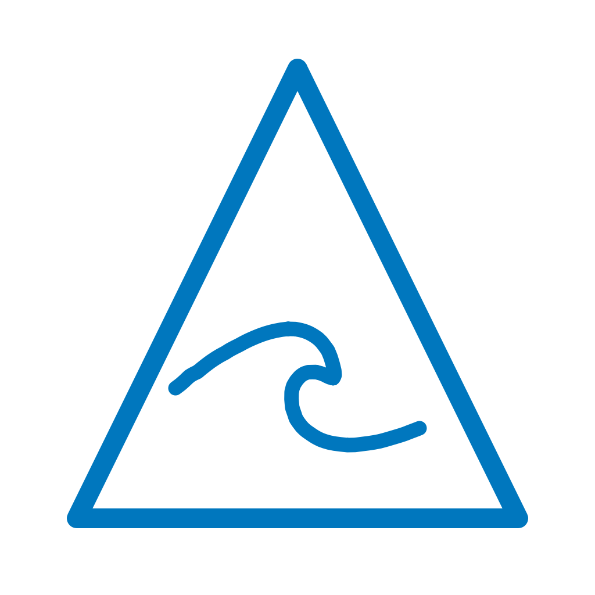
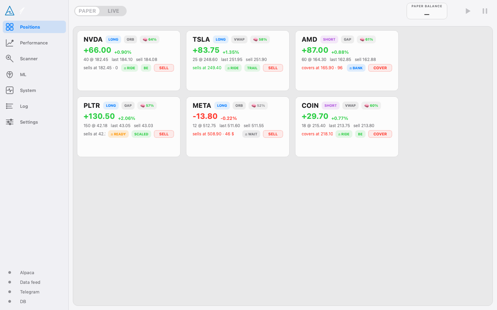
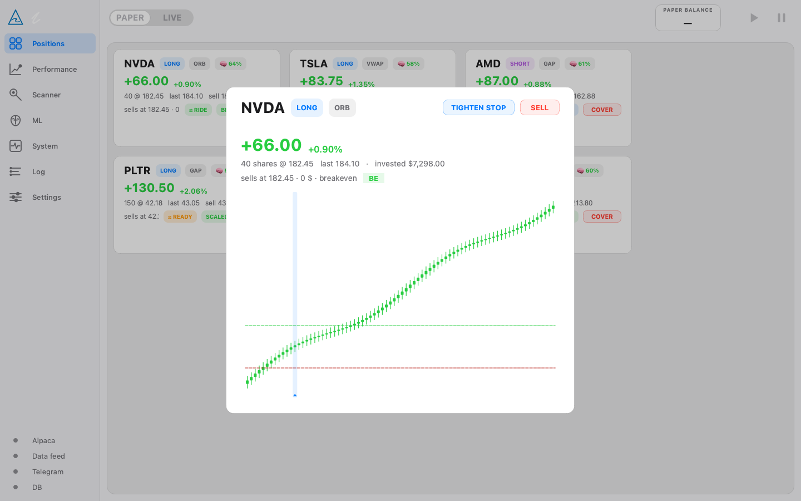

<p align="center">
  
</p>

<h1 align="center">Wave</h1>

<p align="center">
  An autonomous US-equity daytrading bot with a native macOS dashboard.<br/>
  Python 3.12 · PyQt6 + qasync · Alpaca · Polygon.io · SQLite · ~1,000 tests
</p>

---

Wave is a full trading system I designed and built end-to-end: a real-time scanner that ranks the whole US market every minute, an entry engine with session-gated strategies, a seven-layer adaptive exit system, a risk engine that cannot be bypassed, and a polished desktop app that makes the whole machine observable — every decision the engine takes is journaled, explained, and visible in the UI.

It ran a continuous multi-week 24/5 **paper-trading** campaign against Alpaca's live market feeds, managing dozens of concurrent positions per day fully autonomously — entries, scale-outs, trailing stops, halts, short-sale restrictions, reconnects and all.

<p align="center">
  
</p>

<p align="center">
  
</p>

*(Screenshots rendered from sample data via `scripts/demo_screenshot.py`.)*

## What's inside

**The engine** (asyncio, headless-capable)

- **Scanner** — streams the full tradable US universe (~1,500+ symbols), re-ranks every minute on relative volume, gap %, ATR %, spread and catalyst flags, and journals every candidate it accepts *and* rejects — the rejection log doubles as the ML training set.
- **Entry strategies** — pluggable, session-gated families (opening-range breakout on stocks-in-play, VWAP regime-switch, gap-and-go momentum), each producing typed `EntrySignal`s. Direction always comes from rules; ML only gates and sizes.
- **TradeGate** — a first-class cost gate: a trade is refused unless its expected move clears measured spread + calibrated slippage + fees by a safety multiple. Most candidates die here, on purpose.
- **Adaptive exits** — seven simultaneous layers per position (server-side hard stop, breakeven ratchet, ATR chandelier trail, momentum-death exit, scale-out, time stop, session-boundary flatten); the binding constraint wins. A per-second "position judge" state machine (RIDE / READY / WAIT / BANK / CUT) drives exit timing.
- **Risk engine** — fixed-fractional sizing, daily/weekly loss halts, kill switch, SSR (Rule 201) and LULD halt handling, per-minute broker↔DB reconciliation, feed-staleness freezes. Risk checks can be tightened at runtime but never removed — that invariant is tested.
- **Short book** — borrow-aware, SSR-aware, structurally smaller than the long book, with an equity floor that arms/disarms shorting automatically.
- **Broker abstraction** — Alpaca adapter (paper) active; IBKR adapter built and dormant behind the same interface. Paper and live are separated at the *type* level, and every position always has a server-side stop resting at the broker — if the app dies, the broker still protects the book.
- **LLM news layer** — a budget-capped Claude Haiku layer classifies headlines for catalyst flags, plus a shadow-only "advisor" that journals a judgment at key decision moments and gets graded against outcomes. Neither can place or size a trade.

**The research stack**

- An event-driven **simulator that shares the live engine's code paths** (spread crossing, slippage by symbol class, partial fills, LULD/SSR as state changes), plus a vectorbt layer for cheap parameter sweeps.
- A **statistical adoption bar** before anything is promoted: walk-forward validation, deflated Sharpe, PBO, Monte Carlo resampling, parameter-plateau checks, champion/challenger. Backtest wins are treated as suspect until they survive all of it.
- Every trade and every rejected candidate is stored with its full feature vector and outcome — the journal *is* the dataset.

**The app**

- Native macOS look (Apple HIG, liquid-glass materials), fully custom PyQt6 UI: animated one-line wave logo that reflects engine state, hover-expanding sidebar with live connection dots, position cards with per-second P&L and judge-stance chips, an animated "scanner mind" galaxy, a stepped equity curve, a virtualized log browser with full-text search, and Touch ID-gated settings.
- **Telegram bridge** — status, positions and P&L on demand; dangerous commands (pause/stop/kill) require a one-time confirmation code; live/paper switching is deliberately impossible remotely.
- **Security** — all secrets live in the macOS Keychain, never in files; Touch ID gates every dangerous action; a log filter redacts anything token-shaped before it can reach any log destination.

## Architecture

```
┌─────────────────────────── Wave.app ───────────────────────────┐
│  UI (PyQt6)  ←Qt signals→  Engine Core (asyncio)               │
│                                                                 │
│   ├── SessionScheduler    session regimes, holidays, DST        │
│   ├── Scanner             heuristic ranker → ML ranker          │
│   ├── TradeGate           the cost gate                         │
│   ├── RiskEngine          limits, kill switch, SSR/LULD         │
│   ├── PositionActor × N   one independent task per position     │
│   ├── BrokerAbstraction   Alpaca (active) / IBKR (dormant)      │
│   ├── DataHub             websockets, bars, staleness watchdog  │
│   ├── Persistence         SQLite journal: every decision        │
│   └── TelegramBridge      status + code-confirmed commands      │
└─────────────────────────────────────────────────────────────────┘
```

Design decisions I'd defend in an interview: one independent asyncio task per position so no failure cascades; idempotent client order IDs + reconcile-before-acting on every reconnect; UTC everywhere except the UI edge; typed paper/live separation instead of a string flag; and a spec file ([SPEC.md](SPEC.md)) that wins any disagreement with the code.

## Running it

Wave targets macOS on Apple Silicon (Touch ID, Keychain and the glass materials are Mac-native).

```bash
git clone <this repo> && cd wave
python3.12 -m venv .venv
.venv/bin/pip install -e ".[dev]"

# run the test suite (no network, no broker, no secrets needed)
QT_QPA_PLATFORM=offscreen .venv/bin/python -m pytest

# run the app from source
.venv/bin/python -m waveapp.app

# or build the installable .app
bash scripts/build_app.sh
```

To actually connect it you'll need free Alpaca **paper** API keys (entered in Settings → Connections, stored in your Keychain) and optionally a Polygon.io key for historical research. See [docs/INSTALL.md](docs/INSTALL.md).

## Status

Wave did exactly what I built it to do: run autonomously, survive the market's edge cases, and tell me the truth about every trade. After a multi-week paper campaign I've archived the project and moved on to new work — by its own design rules (see §11 of the spec), live capital was always gated behind a statistical bar that I treat as non-negotiable, and I'd rather ship the engineering than rush the gamble. The codebase is the portfolio piece: ~60k lines of engine, UI and tests that treat money-adjacent software with the paranoia it deserves.

## Disclaimer

This is a personal engineering project, shared for educational purposes. It is not financial advice, and nothing here is a claim that any strategy is profitable. If you point software at a brokerage account — even a paper one — you are responsible for what it does.
